# 细胞图像的分割与计数系统
该项目为**数字图像处理**课程实践项目，基于**Matlab**编程实现细胞图像的自动化分割、计数与特征分析，同时完成细胞内红/绿色染色体的识别与定位，解决了细胞粘连、噪声干扰、染色体精准筛选等问题，为生物医学诊断与细胞分析提供自动化技术支撑。

项目实现了从图像预处理、细胞分割、特征提取到染色体识别的全流程自动化处理，支持细胞数量统计、单细面积/周长计算、染色体形态筛选与质心标注，代码通过多组细胞样本（cell1/cell2/cell3）测试，具备一定的鲁棒性。

## 项目背景
细胞图像的精准分割与计数是生物医学研究的基础环节，人工分析存在效率低、主观性强、误差大的问题，且细胞图像易存在**噪声干扰、细胞粘连、染色体形态多样**等难点，传统方法难以实现自动化、高精度的分析。

本项目依托数字图像处理技术，构建自动化处理系统，解决上述痛点，实现细胞与染色体的精准识别、计数和特征提取，为生物医学研究提供高效的工具支持。
## 数据样本展示
当前有3张细胞图像样本，图像中细胞主体显现为蓝色，细胞中存在被染成红色与绿色的染色体。展示如下：
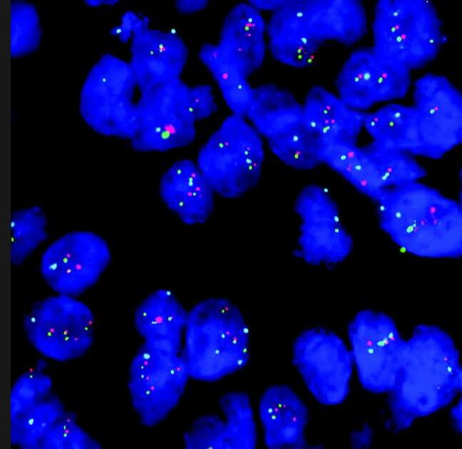
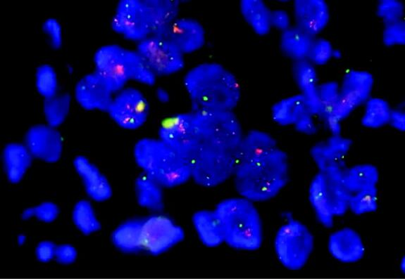
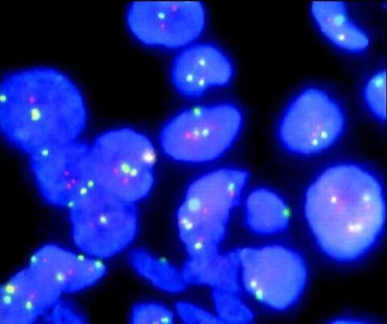

## 核心功能
1. **细胞图像预处理**：自定义滤波、锐化算法，实现噪声去除与边缘增强；
2. **粘连细胞分割**：基于分水岭算法实现粘连细胞的精准切分，完成单个细胞区域提取；
3. **细胞特征分析**：自动统计细胞数量，计算每个细胞的**面积、周长**并可视化标注；
4. **染色体识别计数**：基于R/G颜色通道实现红/绿色染色体筛选，通过形态阈值过滤非目标区域，统计数量并标注质心坐标；
5. **结果可视化**：生成细胞标签着色图、独立细胞展示窗口、染色体质心标注图，直观展示分析结果。

## 实验流程与核心实现
整体流程：`图像读取 → 通道分离 → 预处理（去噪+锐化） → Otsu二值化 → 分水岭分割粘连细胞 → 细胞标签化与特征计算 → 染色体识别与计数 → 结果可视化`
### 1. 图像通道分离
细胞主体为**蓝色**，选取B通道进行细胞分割与特征分析；细胞内红/绿色染色体分别选取**R通道、G通道**进行独立识别，分离不同通道以降低目标干扰。
### 2. 图像预处理
自定义两个核心函数实现去噪与锐化，提升图像质量，为后续分割做准备：
#### （1）中值滤波去噪（`medfilter`）
以3×3窗口遍历图像，通过计算窗口内像素中值替换中心像素，有效抑制图像噪声，保留边缘细节。
#### （2）自定义锐化（`sharpimfilter`）
定义水平/垂直方向三阶梯度核，通过卷积计算像素梯度幅值，提升图像边缘对比度，强化细胞与背景的边界特征。
### 3. Otsu大津法二值化
自定义`Otsu`函数，通过**最大化类间方差**选取最优阈值，实现细胞（前景）与背景的初步分割，得到二值化图像。
核心思想：遍历所有可能阈值，计算不同阈值下前景/背景的类间方差，取方差最大值对应的阈值为最优阈值，提升分割的准确性。

### 4. 分水岭算法分割粘连细胞
针对二值化图像中**细胞粘连严重**的问题，通过分水岭算法（水坝分割）实现粘连细胞的精准切分，核心步骤：
1. `bwareaopen`：移除二值图像中面积过小的噪声区域，净化前景；
2. `bwdist`：距离变换，计算前景像素到最近背景的距离，生成距离灰度图；
3. `imextendedmin`：确定分割种子点，标记每个细胞的核心区域；
4. `imimposemin`：将种子点强制为距离图的局部最小值，确定分割起始点；
5. `watershed`：分水岭变换，基于最小值点实现细胞区域的分割，完成粘连细胞切分。
### 5. 细胞特征分析与计数
通过`bwlabel`对分割后的细胞区域进行**标签化**，每个细胞分配唯一标签，基于标签实现细胞数量统计与特征计算：
#### （1）细胞数量与面积计算
标签数即为**细胞总数**，每个标签下的像素点数量为对应细胞的**面积**，遍历所有标签统计并存储面积数据至`S_list`。
#### （2）细胞周长计算
通过**8邻域检测**判断细胞边界像素：若某像素为细胞区域，且其8邻域存在背景像素，则判定为边界像素，统计所有边界像素数量即为细胞**周长**，结果存储至`C_list`。
#### （3）细胞可视化标注
生成细胞着色图与标签可视化图，在图像中标注细胞编号、面积、周长，并实现**独立细胞展示窗口**：自动根据细胞数量创建窗口（每页9个细胞），提取单个细胞区域并展示其面积、周长信息。
### 6. 红/绿色染色体识别与计数
针对R/G通道的染色体图像，重复**预处理+Otsu二值化**操作（二值化阈值在最优值基础上+50，抑制颜色扩散干扰），通过**形态筛选+质心标注**实现精准识别：
1. **形态筛选**：利用`regionprops`计算连通区域的**离心率（Eccentricity）**，设定阈值`0.9`，筛选**接近圆形**的染色体（离心率越接近0，形状越圆），剔除长条状伪目标；
2. **数量统计**：遍历每个细胞标签区域，统计其中符合形态要求的红/绿色染色体数量，分别存储至`R_Count`、`G_Count`；
3. **质心标注**：记录染色体的质心坐标，在原始图像上用**红点（红染色体）、绿点（绿染色体）** 标注，并在细胞中心标注染色体数量；
4. **边缘过滤**：忽略细胞区域外的染色体，仅统计细胞内的有效目标。
上述加工步骤可视化图像如下所示：

  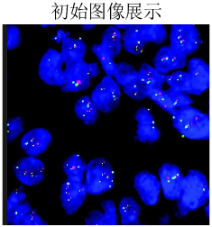
  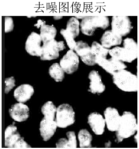
  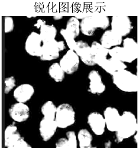

  
  
  

  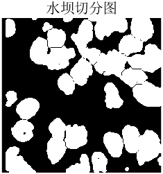
  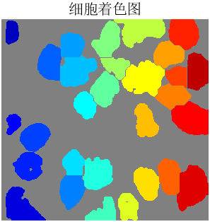
  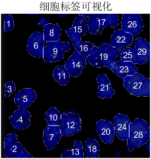

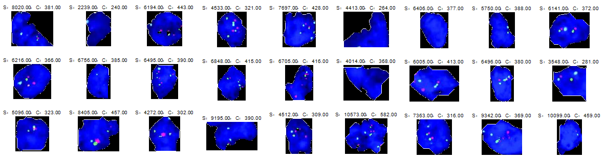

## 项目亮点
1. **自定义算法实现**：自主编写中值滤波、图像锐化、Otsu二值化函数，深入理解数字图像处理底层原理；
2. **粘连细胞高效分割**：基于分水岭算法结合距离变换、种子点标记，完美解决细胞粘连问题，分割精度高；
3. **染色体精准筛选**：通过**颜色通道分离+形态学阈值（离心率）**，有效剔除伪目标，提升染色体识别准确性；
4. **鲁棒性可视化设计**：自动根据细胞数量创建独立展示窗口，适配不同样本的细胞数量，可视化结果清晰、直观；
5. **多特征综合分析**：同时实现细胞面积、周长、数量统计与染色体识别计数，功能全面，贴合生物医学实际需求。

## 项目难点与解决方法
| 难点 | 解决方法 |
| ---- | -------- |
| 图像噪声干扰，边缘模糊 | 自定义3×3中值滤波去噪，结合梯度核锐化算法，强化边缘对比度 |
| 细胞粘连严重，无法单独计数 | 采用分水岭算法，通过距离变换、种子点标记实现粘连细胞精准切分 |
| 染色体颜色扩散，存在误识别 | Otsu二值化阈值偏移+50，抑制非目标区域颜色扩散，降低误检 |
| 染色体形态多样，伪目标多 | 基于离心率设定形态阈值，筛选接近圆形的染色体，剔除长条状伪目标 |
| 边缘细胞缺损，影响统计精度 | 采用面积筛选法（`bwareaopen`），移除面积过小的缺损细胞，保留完整细胞 |

## 实验结果展示
以cell1图像为主要测试样本，实验取得以下结果：
1. 成功分割**28个完整细胞**，实现细胞数量的精准统计；
2. 完成所有细胞的**面积、周长**计算，并在可视化窗口中逐一展示；
3. 精准识别细胞内红/绿色染色体，实现形态筛选、数量统计与质心坐标标注；
4. 代码通过cell2、cell3多组样本测试，均能实现稳定的分割与识别，鲁棒性良好。
3个样本的分割计数效果如下所示：
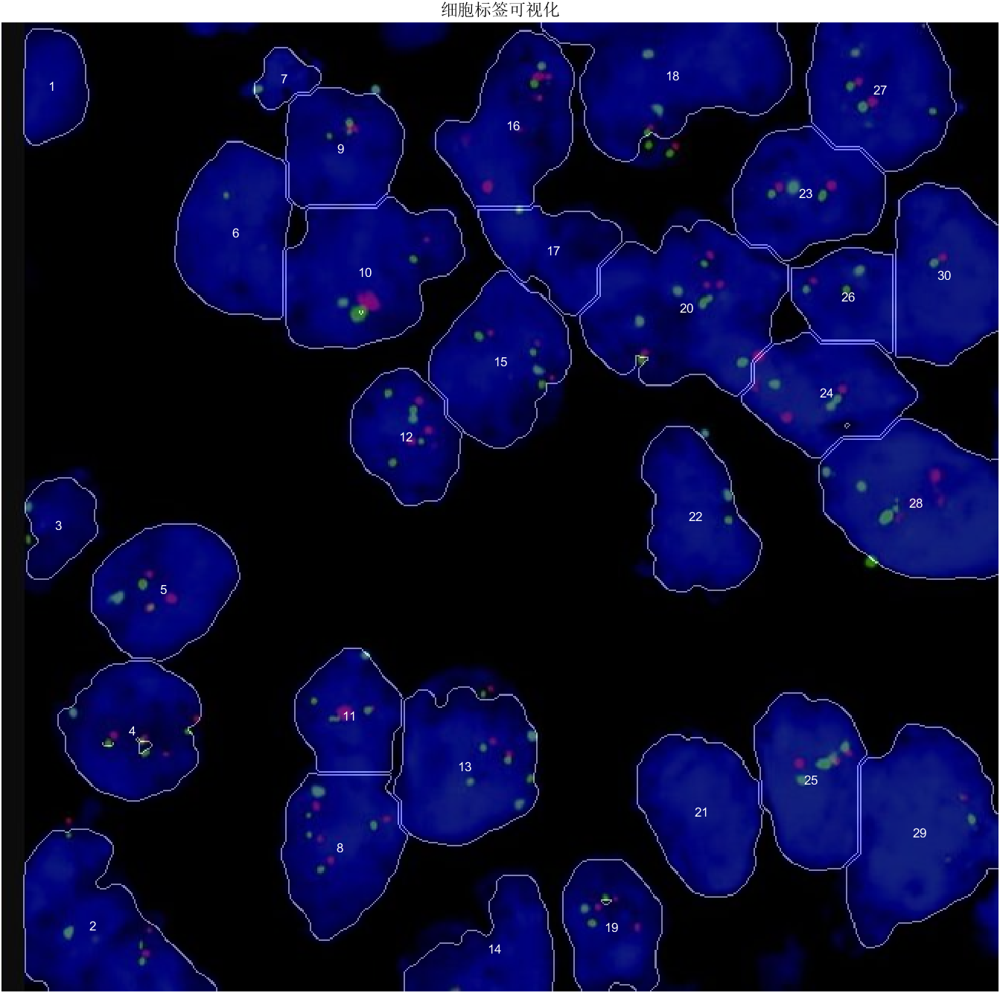
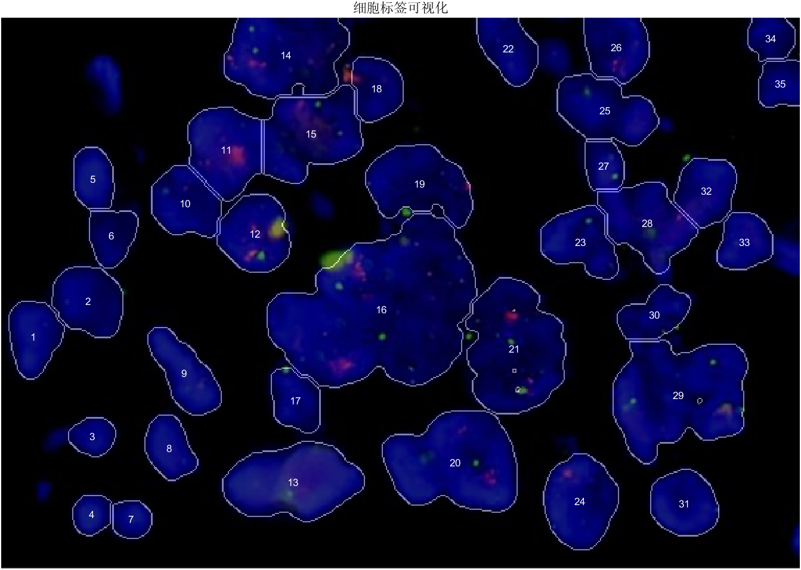
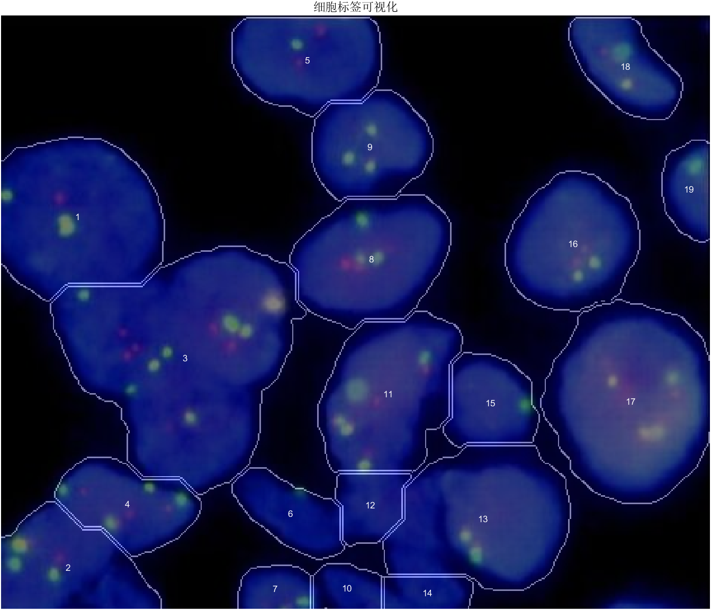

### 项目总结
本项目成功构建了基于Matlab的细胞图像自动化分割与计数系统，融合**中值滤波、自定义锐化、Otsu二值化、分水岭算法**等多种数字图像处理技术，有效解决了细胞图像噪声、粘连、染色体识别等核心问题，实现了细胞与染色体的精准分析和可视化展示。
